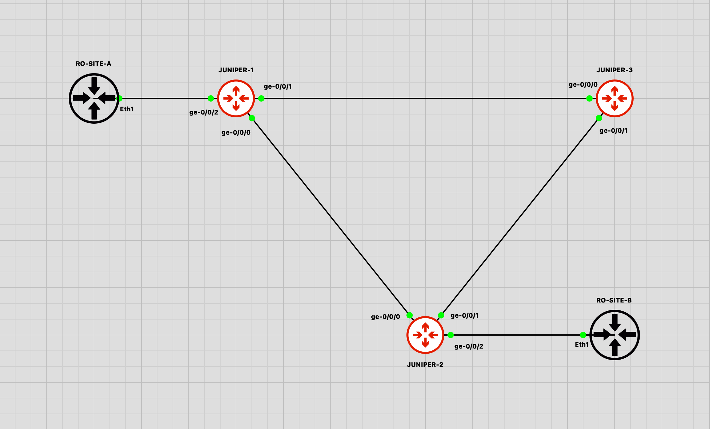
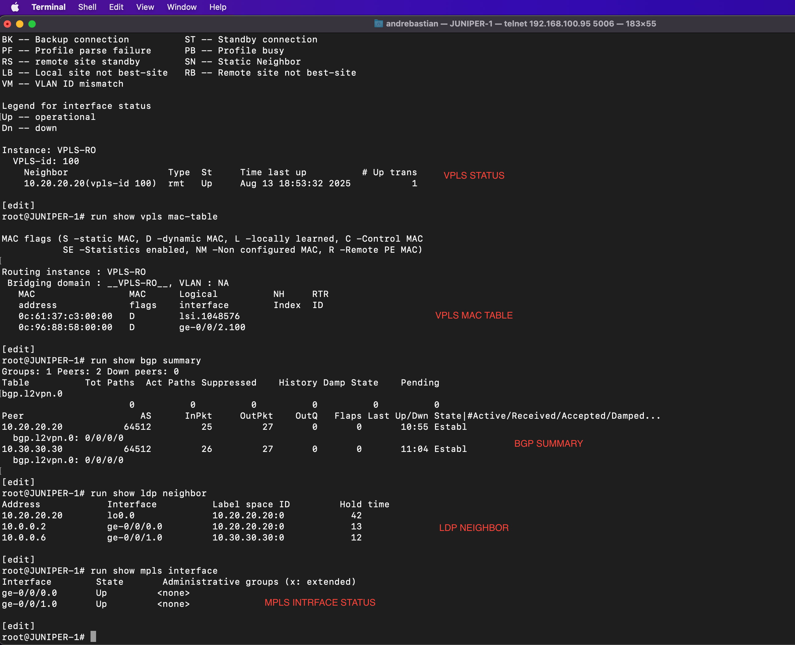
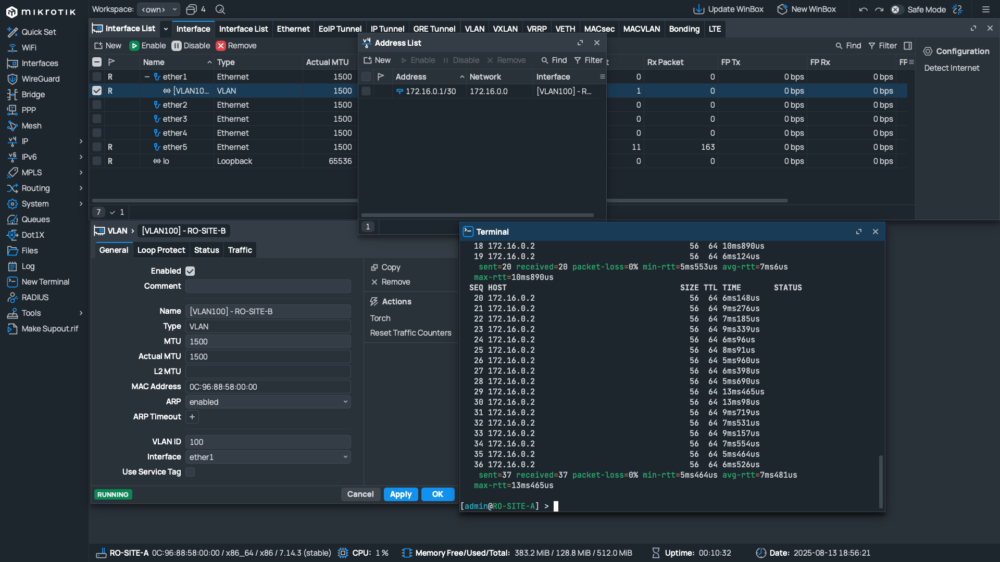

# JUNIPER VPLS

## Topology & Documentation

### Images

#### Topology Overview

#### VPLS, BGP, MPLS, and LDP Status

#### PING from RO-SITE-A to RO-SITE-B

---

## Devices

- **RO**: MikroTik RouterOS 7.14.3
- **JUNIPER**: Juniper vMX-v14.1R1.10  

---

## Link

[https://github.com/andre4freelance/gns3/tree/main/JUINPER-VPLS](https://github.com/andre4freelance/gns3/tree/main/JUINPER-VPLS)